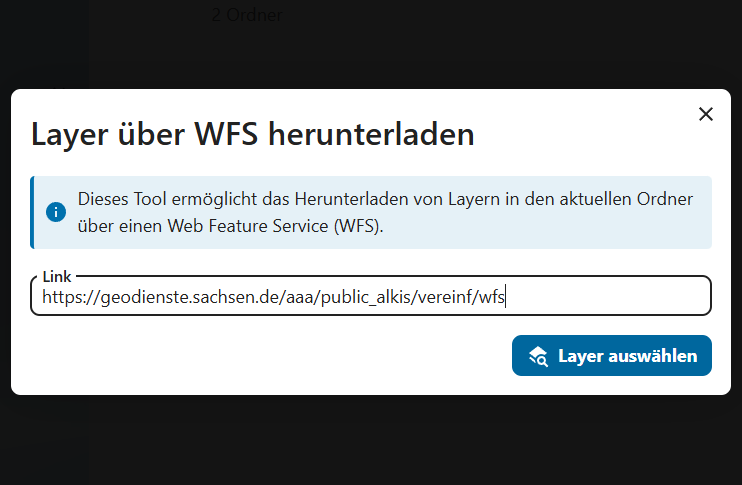
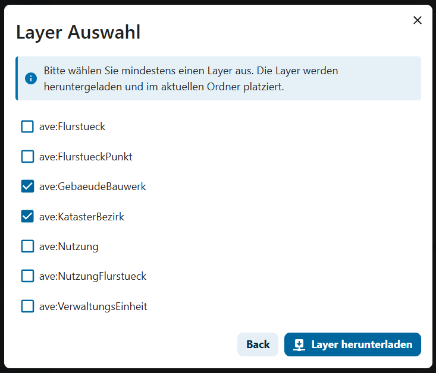

# WFS Downloader

Nextcloud app to send download request for WFS Layers.

  
  

## Usage

TODO

## Resources

### Documentation for developers

- General documentation and tutorials: <https://nextcloud.com/developer>
- Technical documentation: <https://docs.nextcloud.com/server/latest/developer_manual>

### Help for developers

- Official community chat: <https://cloud.nextcloud.com/call/xs25tz5y>
- Official community forum: <https://help.nextcloud.com/c/dev/11>
